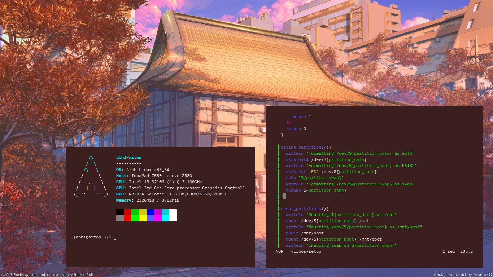

<h1 align=center>Welcome to my Github</h1>

I am a teenager who is keen at developing Linux distros and learning how Arduino works Currently developing VirbOS and NemesisOS

___

<h1 align=center>Some Info About My Computer</h1>

- OS:- Arch Linux x86_64
- GUI Based Editor:- Code-OSS
- TUI Based Editor:- Helix
- Languages:- Python, Shell, Go, C++(Arduino)
- Projects:- VirbOS(WIP), NemesisOS(WIP), Harvester(Arduino)

> ### Preview:-

